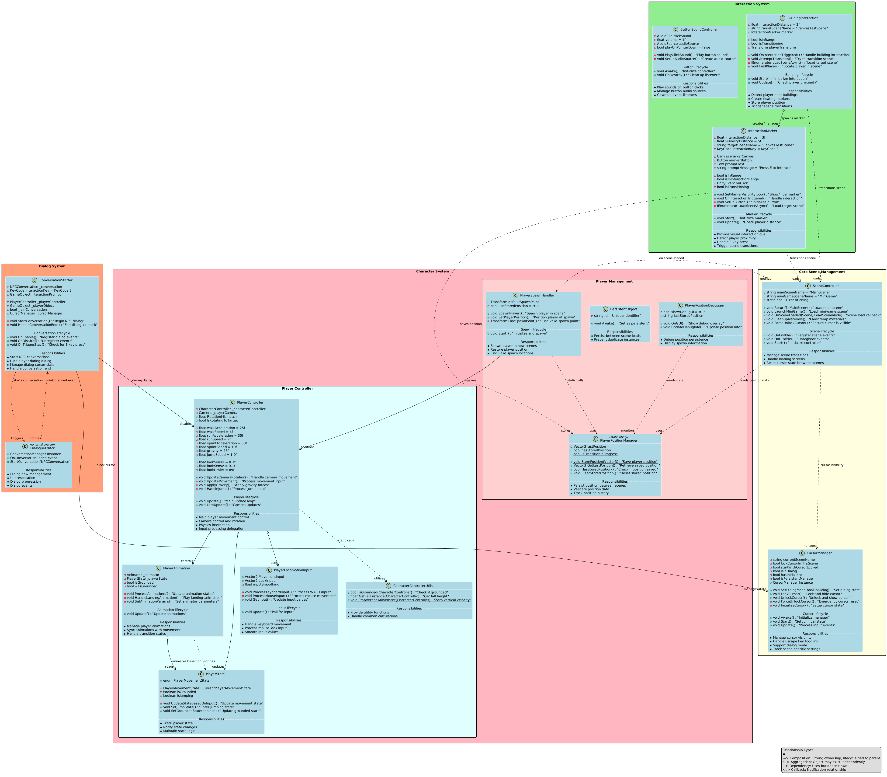

# Student Recruitment Game Demo

A 3D web-based interactive demo showcasing a university campus environment where players can explore and interact with buildings. Built with Unity and optimized for WebGL deployment.

**[Play the Demo](https://maliksheharyaar.github.io/my-unity-webgl-game/)**
**IMPORTANT**: Make sure to click the within the game after launching to bound mouse to center of the screen to allow continuous character rotation. Press "ESC" to unbound the mouse

**IMPORTANT**: Download all necessary assets or game wont work as expected. Due to Licencing reasons (some assets use Entension type Licence), each individual developer directly working on this projects is required to purchase(Free) the assets from the unity asset store. There to comply to licencing, all such asset files have been removed from the project and the download and importing of the required assets is necessary for the assets to automatically reconnect to the missing assets.

## 🎮 Features

### Player Controls
- **Movement**: WASD keys for character movement
- **Camera Control**: 
  - Mouse movement for camera rotation
  - Locked cursor system for smooth 360° viewing
  - Automatic cursor state management
- **Cursor Management**: 
  - ESC to toggle cursor visibility
  - Left-click to re-lock cursor when unlocked
  - Scene-aware cursor state transitions
  - Automatic cursor unlocking in UI scenes

### Scene Management
- **Main Scene (3D Environment)**:
  - Fully 3D navigable environment
  - Building interaction system with proximity detection
  - Position persistence between scene transitions
  - Optimized cursor controls for smooth camera movement
  - Raycast-based interaction detection

- **Canvas Test Scene (UI Interface)**:
  - Clean UI interface with responsive buttons
  - Scene transition management
  - Book collection system display
  - Pages crafting functionality
  - Automatic cursor state handling

### Interaction Systems
- **Building Interaction**:
  - Proximity-based interaction detection using collider bounds
  - Visual feedback for interaction zones using Gizmos
  - Interaction point calculated from building center
  - Configurable interaction distance
  - Scene transition handling with position saving

### Endless Runner Game
- **Gameplay Features**:
  - Procedurally generated track with obstacles, coins, and power-ups
  - Lane-based movement system (left/right/center)
  - Jumping mechanics for obstacle avoidance
  - Collision detection with bounce-back effect
  - Score system based on distance traveled
  - Lives system with game over conditions
  - Power-ups (invincibility, speed boost)
  - Finish line to complete levels

- **Controls**:
  - Left/Right arrows or A/D: Change lanes
  - Space/Up arrow/W: Jump
  - P/Backspace/ESC: Pause game

- **Technical Features**:
  - Object culling system for performance optimization
  - Procedural track generation
  - Character animation system
  - Dynamic difficulty scaling
  - Cross-scene data persistence

### Book Collection System
- **Reward Mechanism**:
  - Earn coins based on score and performance
  - Collect special pages by reaching achievements
  - Craft complete books with collected pages
  - Persistent progress across game sessions

- **UI Components**:
  - BookViewPanel for reviewing collected pages
  - PageDetailPanel for detailed information
  - PageListScrollRect for navigating collected pages
  - Progress tracking and display
  - Reset functionality for player progress

### Technical Features
- **Position Management**:
  - Static position management system
  - Vector3 position validation
  - Position bounds checking
  - Transition state tracking
- **Scene Persistence**:
  - ScenePersistenceManager for cross-scene data handling
  - PlayerPrefs-based save system
  - BookManager singleton for tracking collections
  - CanvasSceneInitializer for UI element connections
- **Debug Systems**:
  - Debug logging system
  - Position update counter
  - Error handling for WebGL context

### 🔧 Optimization
- WebGL-specific optimizations
- Scene loading optimization
- Memory management with proper resource cleanup
- Position validation system
- Error handling for WebGL context

## UML Overview


## 🚀 Setup Instructions

### Prerequisites
1. **Unity Version**: 2022.3.19f1 or higher
2. **Required Packages**:
   - Universal Render Pipeline (URP)
   - ProBuilder
   - TextMeshPro
   - Input System (New)
3. **Required Unity Store Assets**: 
   - FREE CASUAL PACK SFX
   - Dialogue Editor
   - 2D Casual UI HD
   - Loading screen animation
   - Lowpoly Environment - Nature Free - MEDIEVAL FANTASY SERIES
   - Low Poly Modular Characters
   - Free Pixel Font - Thaleah
   - FREE Low Poly Human - RPG Character
   - Polygonal's Low-Poly Particle Pack
   - Ten Power-Ups
   - Fantasy Skybox FREE
   - Fantasy landscape

### Project Setup based on just cloning the project
1. **Initial Setup**:
   ```
   1. Clone repository or branch (git clone --branch BRANCH_NAME --single-branch https://github.com/maliksheharyaar/CampusRecruitment.git)
   2. Open project in Unity, when the "Unity Package Manager Error" shows just click "Continue"
   3. When the pop-up for "Enter Safe Mode?" appears, just "Enter Safe Mode"
   4. When the project opens up, there will be errors regarding missing assets. Now assuming you have subscribed to the above Unity store Assets.To fix those error goto the tab Windows > Package Manager > in My Assets download all the ones mentioned above
   5. Then after downloading all of them, just import the asset "Dialogue Editor" and this will cause the script in Assets/Editor/AutoImportUnityStoreAssets.cs to run which will import the rest of the assets together. This script only runs the first time and then creates a FirstLaunchComplete.txt file which just prevents the script from running again (NOTE: Don't include this .txt file in your git commits)
   6. Open MainScene from Assets/Scenes/ and explore
   7. Some of the assets might be showing their material as "pink" colored, to fix that goto the tab Window > Rendering > Render Pipeline Converter -> check the "Material Upgrade" checkbox and then in the bottom right click "Initalize and Convert". That should take care of those missing material issues.
   8. If something is still pink then thats your problem now, tweak around the material a bit, or google it...

   ```

### Project Setup - Reference
1. **Initial Setup**: Most of this is only for reference sake as the scenes are already setup
   ```
   1. Clone repository
   2. Open project in Unity
   3. Install required packages via Package Manager
   4. Open MainScene from Assets/Scenes/
   ```

2. **Scene Configuration**:
   ```
   1. Create empty GameObject named "Managers"
   2. Add required manager components:
      - CursorManager
      - PlayerSpawnHandler
      - PersistentObject
   3. Ensure Player object has "Player" tag
   ```

3. **Building Setup**:
   ```
   1. Add BuildingInteraction component to building
   2. Set interaction distance in Inspector
   3. Ensure building has either:
      - MeshRenderer component
      - Or valid transform position
   ```

4. **Player Configuration**:
   ```
   1. Tag player GameObject as "Player"
   2. Add required components:
      - Character Controller/Rigidbody
      - Camera setup for rotation
   3. Configure movement settings
   ```

5. **Endless Runner Setup**:
   ```
   1. Configure EndlessRunnerManager with track segments
   2. Set up obstacle and power-up prefabs
   3. Configure player controller settings
   4. Set up UI elements for score, lives, and game state
   5. Connect EndlessRunnerRewards to BookManager
   ```

6. **Book Collection Setup**:
   ```
   1. Configure BookManager with page details
   2. Set up UI panels in CanvasTestScene
   3. Ensure ScenePersistenceManager is present
   4. Set up CanvasSceneInitializer for UI connections
   ```

### Build Settings
1. **WebGL Settings**:
   ```
   1. Switch platform to WebGL
   2. Player Settings:
      - Compression Format: Disabled (for GitHub Pages)
      - Memory Size: 512MB
      - Enable Exception Support: Yes
   ```

2. **Scene Setup**:
   ```
   1. Add scenes to build settings:
      - MainScene (index 0)
      - CanvasTestScene (index 1)
      - EndlessRunner (index 2)
   2. Enable "Auto Build" for WebGL
   ```

### Debug Setup
1. **Position Debugging**:
   ```
   1. Add empty GameObject "PositionDebugger"
   2. Attach PlayerPositionDebugger component
   3. Enable "Development Build" for logging
   ```

## 📝 Development Notes

### Integration Points
1. **Main Scene to Endless Runner**:
   - Building interaction triggers scene load
   - Position data saved before transition
   - EndlessRunnerRewards tracks performance

2. **Endless Runner to Canvas Scene**:
   - Rewards calculated on game completion
   - Data stored via PlayerPrefs
   - ScenePersistenceManager ensures data transfer

3. **Canvas Scene Book System**:
   - BookManager loads saved progress
   - UI displays collected pages and coins
   - Crafting system allows book completion

## 🚀 Deployment

### GitHub Pages Setup
1. Build WebGL project
2. Configure repository settings
3. Enable GitHub Pages
4. Set build folder as source

### Build Optimization
- Disabled compression (GitHub Pages handles this)
- Minimal memory allocation
- Optimized asset loading
- Browser compatibility checks

## 📦 Future Updates
- [ ] Additional building interactions
- [ ] More mini-games beyond Endless Runner
- [ ] Enhanced UI feedback
- [ ] More campus areas
- [ ] Character customization options
- [ ] Additional book collections and rewards


### Important Considerations
1. **Position Management**:
   - Position is saved before scene transitions
   - Validation occurs during save/load
   - Automatic cleanup after position restoration

2. **Scene Transitions**:
   - Cursor state changes automatically
   - Position data persists through static manager
   - Scene loading handles edge cases

3. **Memory Management**:
   - Proper resource cleanup in OnDestroy methods
   - Event unsubscription to prevent memory leaks
   - Optimized object pooling for repeated elements
